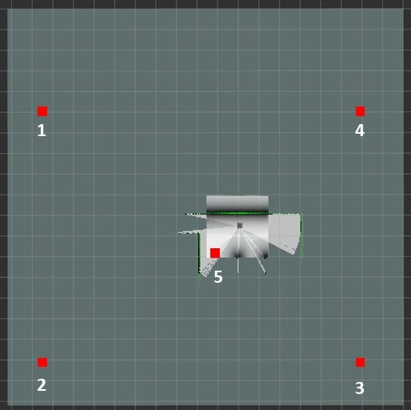
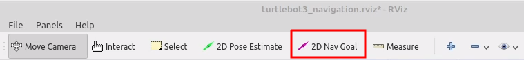

# ENPM690 HW#3
1) Keyboard operation of turtlebot robot in Gazebo
2) Autonomous robotic exploration based on multiple rapidly-exploring randomized trees

This is a ROS-1 (Melodic) project using C++

ENPM690 Spring 2022
Section RO01

Jerry Pittman, Jr. UID: 117707120
jpittma1@umd.edu

Based on previous work with Matreya Kulkarni (ENPM661 Spring 2022):
Previous work Github Repo: https://github.com/jpittma1/ENPM661_Project5_RRT.git

This Homework's Github repo: https://github.com/jpittma1/ENPM690.git

### videos Are here:
https://drive.google.com/drive/folders/1xbY_yPHkRcj-BtaGveC07KHgtYrARpMl

> **You can see the [Towards Data Science Story of this Project](https://mohamedfazilrobotics.medium.com/ros-autonomous-slam-using-randomly-exploring-random-tree-rrt-37186f6e3568)**

#Install:
```
source /opt/ros/noetic/setup.bash
mkdir -p ~/enpm690_ws/src
cd ~/enpm690_ws/src
```

##Copy this repository (ENPM690_hw3) into the src directory of the workspace

##Install dependencies:
```
sudo apt install python3-rosdep
sudo rosdep init
rosdep update --include-eol-distros
rosdep install --from-paths src -y --ignore-src
```

#Catkin build the workspace
```
catkin build
```

#Source the workspace
```
~/enpm690_ws/devel/setup.bash
```

##How to Run/ Execute....
### Part 1) Teleop control of robot in world

Set your environment variable to the model robot to be used in bashrc/,zshrc file.
```
export TURTLEBOT3_MODEL=waffle_pi

```
Terminal 1 (world): roslaunch ros_autonomous_slam turtlebot3_world.launch

Terminal 2 (teleop): roslaunch turtlebot3_teleop turtlebot3_teleop_key.launch

### Part 2) Obstacle avoidance based on sensors (LiDAR)


## Step 1 : Place the Robot in the Environment within Gazebo
Set your environment variable to the model robot to be used in bashrc/,zshrc file.
```
export TURTLEBOT3_MODEL=waffle_pi

```
Execute the given launch to open Gazebo with the given world file and place the robot Turtlebot3 Waffle pi model in it.
Terminal 1:
```
roslaunch ros_autonomous_slam turtlebot3_world.launch
```
Keep this process running always and execute other commands in a different terminal.
## (Optional) Step 2 : Perform Autonomous exploration of the environment and generate the Map
# This step is not necessary since I have created the **my_map.pgm** and **my_map.yaml** files already.
Terminal 2:
```
roslaunch ros_autonomous_slam autonomous_explorer.launch
--OR--
roslaunch ros_autonomous_slam autonomous_explorer.launch explorer:=RRT
```

Run the Autonomous Explorer launch file which executes two tasks for us at the same time:
1. It starts the **SLAM** node in the Navigation stack with a custom modified RVIZ file to monitor the mapping of the environment.
2. It simultaneously starts the **Autonomous explorer** which is a Python based controller to move around the robot grazing all the areas whcih helps the **SLAM** Node to complete the mapping. The default algorithm used for the exploration is RRT algorithm. 

The RRT exploration requires a rectangular region around to be defined in the RVIZ window using four points and an starting point for exploration within the known region of the robot. The total five points must be defined in the exact sequence given below using the RVIZ **Publish Points** option (Top Left, Bottom Left, Bottom Right, Top Right, On/near Robot in white LiDAR visibile region). [Source](http://wiki.ros.org/rrt_exploration/Tutorials/singleRobot)<br />
 <br />

**Monitor the Mapping process in RVIZ window** and sit back and relax unitll our robot finishes mapping.
<br />


**Once you are satisfied with the constructed map, Save the map.**
Terminal 3:
```
rosrun map_server map_saver -f my_map
```
The **my_map.pgm** and **my_map.yaml** gets saved in your worspace directory. Move these to files to the package's **maps** folder (catkin_ws\src\ros_autonomous_slam\maps).**Now your new map which is basically a occupancy grid is constructed !** 

## Step 3 : Perform pathplanning and go to goal in the environment
We will be using the Navigation stack of the ROS to perform the pathplanning and go to goal using /movebase/goal actions. The given blow launch execution opens up a RVIZ window which shows the Robot location within the previously constructed map.
Terminal 3 (or 2 if skipped step 2): 
```
roslaunch ros_autonomous_slam turtlebot3_navigation.launch
```
The RVIZ Window shows the robot's local map construction using its Laser sensors with respect to the Global Map previously constructed in Step 2 with help of a cost map.

### Setting Goal in the RVIZ Window
- First estimate the initial Pose i.e locating the real robot location with respect to the Map. This can be set in the RVIZ window itself using the **2D Pose Estimate** and pointing and dragging the arrow in the current robot's locaion and orientation.<br />

- An GOAL point can be set in the RVIZ window itself using the **2D Nav Goal** option which will be available in the top window tab.This allows you to set a goal point in the map within the RVIZ environment, then the robot automaticals performs the path palnning and starts to move in its path.<br />



### videos Are here:
https://drive.google.com/drive/folders/1xbY_yPHkRcj-BtaGveC07KHgtYrARpMl
